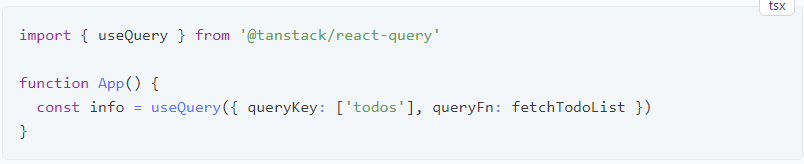
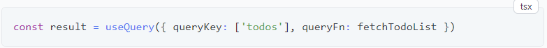
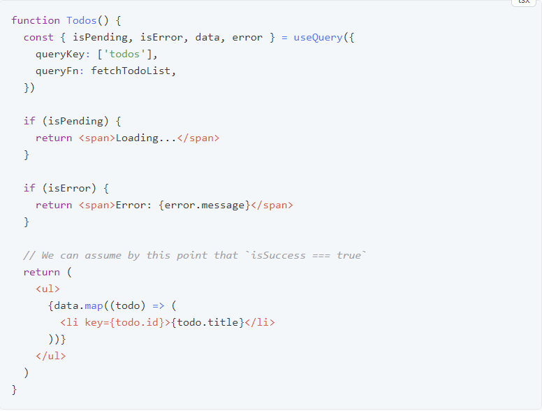
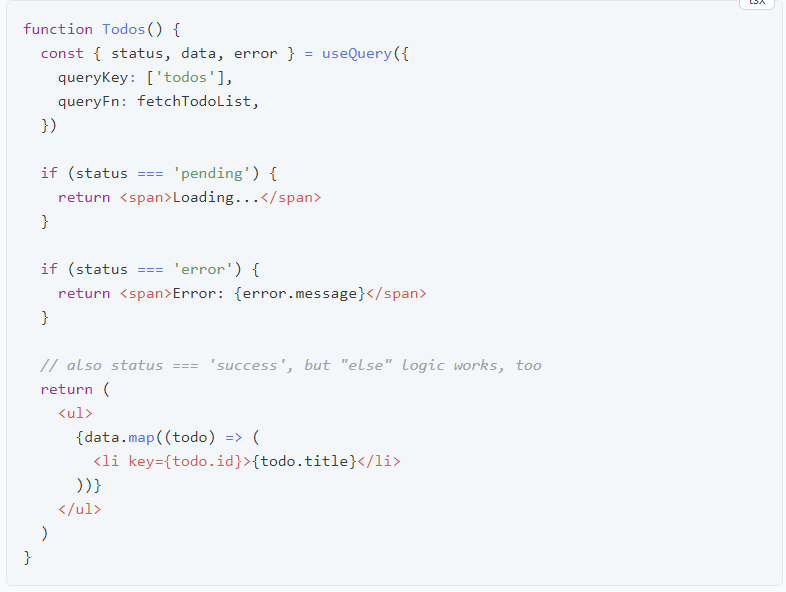

# TanStack Query - React Query

## Índice
- [1. Overview](#1-overview)
- [2. Queries](#2-queries)
- [2.1. FetchStatus ](#21-fetch-status)
- [3. Query Keys](#3-query-keys)
- [4. Query Functions]()

### 1. Overview
TanStack Query (formalmente conhecido como React Query) é frequentemente descrito como a biblioteca de busca de dados ausentes para aplicativos da web, mas em termos mais técnicos, facilita muito a busca, o armazenamento em cache, a sincronização e a atualização do estado do servidor em seus aplicativos da web;

### 2. Queries
Uma query é uma dependência declarativa de uma fonte assíncrona de dados vinculada a uma chave exclusiva . Uma query pode ser usada com qualquer método baseado em Promises (incluindo os métodos GET e POST) para buscar dados de um servidor. Se o seu método modificar dados no servidor, recomendamos usar Mutations .

Para assinar uma query em seus componentes ou custom hooks, chame o **useQuery** hook com pelo menos:

* Uma chave exclusiva para a consulta
* Uma função que retorna uma promessa que:
* Resolve os dados ou
* Lança um erro

A chave exclusiva que você fornece é usada internamente para buscar novamente, armazenar em cache e compartilhar suas consultas em todo o aplicativo.

O resultado da consulta retornado por *useQuery* contém todas as informações sobre a consulta necessárias para a modelagem e qualquer outro uso dos dados:

O objeto *result* contém alguns estados muito importantes dos quais você precisa estar ciente para ser produtivo. Uma query(consulta) só pode estar em um dos seguintes estados em um determinado momento:

* **isLoading** ou **status === 'loading'**- A consulta ainda não possui dados;
* **isError** ou **status === 'error'**- A consulta encontrou um erro;
* **isSuccess** ou **status === 'success'** - A consulta foi bem-sucedida e os dados estão disponíveis.

Além desses estados primários, mais informações estão disponíveis dependendo do estado da consulta:

* **error** - Se a consulta estiver no estado **isError**, o erro estará disponível através da propriedade **error**.
* **data** - Se a consulta estiver no estado **isSuccess**, os dados estarão disponíveis por meio da propriedade **data**.
* **isFetching** - Em qualquer estado, se a consulta for buscada a qualquer momento (incluindo a busca em segundo plano), **isFetching** será **true**.

Para a maioria das consultas, geralmente é suficiente verificar o estado **isPending**, depois o **isErro** e, finalmente, assumir que os dados estão disponíveis e renderizar o estado bem-sucedido:

Você também pode usar o estado **status** ao invés de booleanos:

O TypeScript também restringirá o tipo **data** corretamente se você tiver verificado **pending** e **error** antes de acessá-lo.

#### 2.1 Fetch Status
Além do campo **status**, você também receberá uma propriedade **fetchStatus** adicional com as seguintes opções:

* **fetchStatus === 'fetching'**- A query está sendo buscada no momento.
* **fetchStatus === 'paused'**- A query queria buscar, mas está pausada. 
* **fetchStatus === 'idle'**- A query não está fazendo nada no momento.

##### Por que dois estados diferentes?
Refetches em segundo plano e a lógica obsoleta durante a revalidação tornam todas as combinações para **status** e **fetchStatus** possíveis. Por exemplo:

* uma query no status **success** geralmente estará em **idle** fetchStatus, mas também poderá estar em **fetching** se uma nova busca em segundo plano estiver acontecendo (refetching).
* uma query sem dados geralmente estará no status **pending** e no status **fetching** mas também poderá estar **paused**se não houver conexão de rede.

Portanto, lembre-se de que uma consulta pode estar **pending** sem realmente buscar dados. Tome como um princípio básico:

* O **status** dá informações sobre **data**: ​​Temos ou não?
* O **fetchStatus** fornece informações sobre **queryFn**: ​​Está funcionando ou não?

### 3. Query Keys