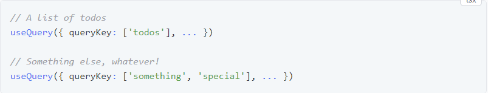
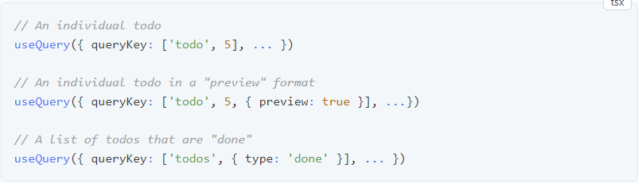
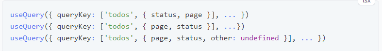
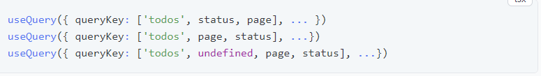
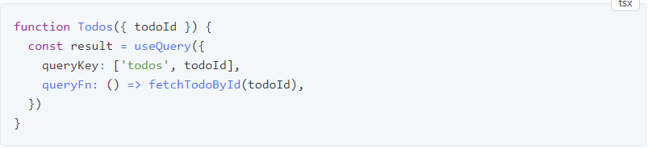
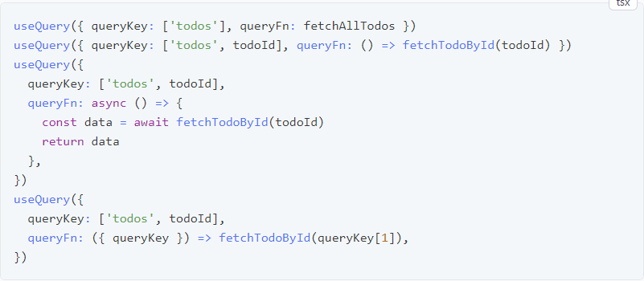
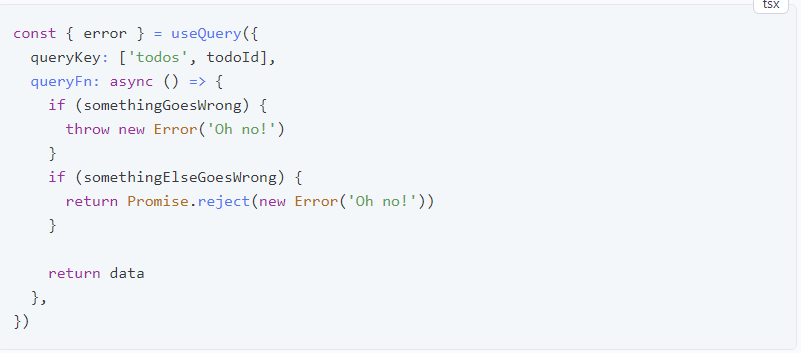
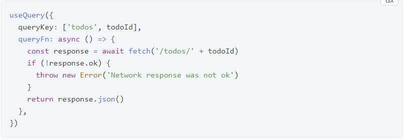
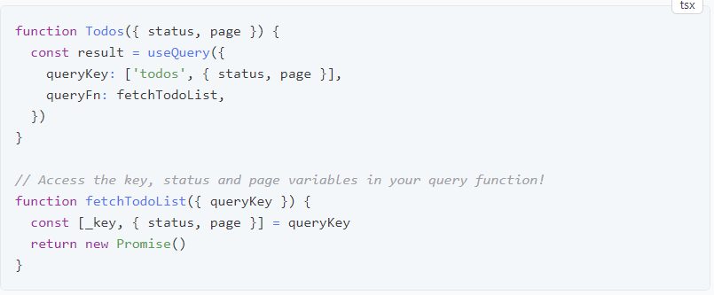

# TanStack Query - React Query

## Índice
- [1. Overview](#1-overview)
- [2. Queries](#2-queries)
- [2.1. FetchStatus ](#21-fetch-status)
- [3. Query Keys](#3-query-keys)
- [3.1 Query Keys Simples](#31-query-keys-simples)
- [3.2 Array Keys com variáveis](#32-array-keys-com-variáveis)
- [4. Query Functions](#4-query-functions)
- [4.1 Tratamento e lançamento de erros](#41-tratamento-e-lançamento-de-erros)
- [4.2 Variáveis Query Function](#42-variáveis-query-function)
- [5. Query Function Context](#5query-function-context)

### 1. Overview
TanStack Query (formalmente conhecido como React Query) é frequentemente descrito como a biblioteca de busca de dados ausentes para aplicativos da web, mas em termos mais técnicos, facilita muito a busca, o armazenamento em cache, a sincronização e a atualização do estado do servidor em seus aplicativos da web;

### 2. Queries
Uma query é uma dependência declarativa de uma fonte assíncrona de dados vinculada a uma chave exclusiva . Uma query pode ser usada com qualquer método baseado em Promises (incluindo os métodos GET e POST) para buscar dados de um servidor. Se o seu método modificar dados no servidor, recomendamos usar Mutations .

Para assinar uma query em seus componentes ou custom hooks, chame o **useQuery** hook com pelo menos:

* Uma chave exclusiva para a consulta
* Uma função que retorna uma promessa que:
* Resolve os dados ou
* Lança um erro

A chave exclusiva que você fornece é usada internamente para buscar novamente, armazenar em cache e compartilhar suas consultas em todo o aplicativo.

O resultado da consulta retornado por *useQuery* contém todas as informações sobre a consulta necessárias para a modelagem e qualquer outro uso dos dados:

O objeto *result* contém alguns estados muito importantes dos quais você precisa estar ciente para ser produtivo. Uma query(consulta) só pode estar em um dos seguintes estados em um determinado momento:

* **isLoading** ou **status === 'loading'**- A consulta ainda não possui dados;
* **isError** ou **status === 'error'**- A consulta encontrou um erro;
* **isSuccess** ou **status === 'success'** - A consulta foi bem-sucedida e os dados estão disponíveis.

Além desses estados primários, mais informações estão disponíveis dependendo do estado da consulta:

* **error** - Se a consulta estiver no estado **isError**, o erro estará disponível através da propriedade **error**.
* **data** - Se a consulta estiver no estado **isSuccess**, os dados estarão disponíveis por meio da propriedade **data**.
* **isFetching** - Em qualquer estado, se a consulta for buscada a qualquer momento (incluindo a busca em segundo plano), **isFetching** será **true**.

Para a maioria das consultas, geralmente é suficiente verificar o estado **isPending**, depois o **isErro** e, finalmente, assumir que os dados estão disponíveis e renderizar o estado bem-sucedido:

Você também pode usar o estado **status** ao invés de booleanos:

O TypeScript também restringirá o tipo **data** corretamente se você tiver verificado **pending** e **error** antes de acessá-lo.

#### 2.1 Fetch Status
Além do campo **status**, você também receberá uma propriedade **fetchStatus** adicional com as seguintes opções:

* **fetchStatus === 'fetching'**- A query está sendo buscada no momento.
* **fetchStatus === 'paused'**- A query queria buscar, mas está pausada. 
* **fetchStatus === 'idle'**- A query não está fazendo nada no momento.

##### Por que dois estados diferentes?
Refetches em segundo plano e a lógica obsoleta durante a revalidação tornam todas as combinações para **status** e **fetchStatus** possíveis. Por exemplo:

* uma query no status **success** geralmente estará em **idle** fetchStatus, mas também poderá estar em **fetching** se uma nova busca em segundo plano estiver acontecendo (refetching).
* uma query sem dados geralmente estará no status **pending** e no status **fetching** mas também poderá estar **paused**se não houver conexão de rede.

Portanto, lembre-se de que uma consulta pode estar **pending** sem realmente buscar dados. Tome como um princípio básico:

* O **status** dá informações sobre **data**: ​​Temos ou não?
* O **fetchStatus** fornece informações sobre **queryFn**: ​​Está funcionando ou não?

### 3. Query Keys
Basicamente, o TanStack Query gerencia o cache de consultas para você com base nas chaves de consulta. As chaves de consulta devem ser um array no nível superior e podem ser tão simples quanto um array com uma única string ou tão complexas quanto um array de muitas strings e objetos aninhados. Contanto que a chave de consulta seja serializável e exclusiva para os dados da consulta , você poderá usá-la!

#### 3.1 Query Keys Simples
A forma mais simples de uma chave é um array com valores constantes. Este formato é útil para:

* Recursos genéricos de lista/índice.
* Recursos não hierárquicos.

#### 3.2 Array Keys com variáveis
Quando uma query precisa de mais informações para descrever exclusivamente seus dados, você pode usar um array com uma string e qualquer número de objetos serializáveis ​​para descrevê-la. Isso é útil para:

* Recursos hierárquicos ou aninhados
    * É comum passar um ID, índice ou outro primitivo para identificar exclusivamente o item
* Queries com parâmetros adicionais
    * É comum passar um objeto de opções adicionais

Não importa a ordem das chaves nos objetos, todas as consultas a seguir são consideradas iguais:

As query keys a seguir, entretanto, não são iguais. A ordem dos itens do array é importante!

#### Se a sua query function depende de uma variável, inclua-a na sua query key

Como as chaves de consulta descrevem exclusivamente os dados que estão buscando, elas devem incluir quaisquer variáveis ​​que você usar em sua função de consulta que sejam alteradas . Por exemplo:

Observe que as query keys atuam como dependências para suas query functions. Adicionar variáveis ​​dependentes à sua query key garantirá que as consultas sejam armazenadas em cache de forma independente e que sempre que uma variável for alterada, as consultas serão refeitas automaticamente (dependendo das suad configurações *staleTime*).

### 4. Query Functions
Uma query function pode ser literalmente *qualquer função que retorne uma promessa*. A promessa retornada deve resolver os dados ou gerar um erro .

Todas as opções a seguir são configurações de query function válidas:

#### 4.1 Tratamento e lançamento de erros
Para que o TanStack Query determine que uma consulta apresentou erro, a query function deve lançar ou retornar uma promessa rejeitada . Qualquer erro gerado na função de consulta persistirá no estado **error** da consulta.

##### Uso com fetch e outros clientes que não lançam por padrão
Embora a maioria dos utilitários como **axios** ou **graphql-request** gere erros automaticamente para chamadas HTTP malsucedidas, alguns utilitários como **fetch** não lançam erros por padrão. Se for esse o caso, você precisará lançá-los por conta própria. Aqui está uma maneira simples de fazer isso com a **fetch** API popular:

#### 4.2 Variáveis Query Function 
As query keys não servem apenas para identificar exclusivamente os dados que você está buscando, mas também são convenientemente passadas para sua query function como parte do QueryFunctionContext. Embora nem sempre seja necessário, isso possibilita extrair suas query functions, se necessário:

#### 5.Query Function Context
O **QueryFunctionContext** é o objeto passado para cada query function. Isso consiste de:

* **`queryKey: QueryKey`**: Query Keys
* **`signal?: AbortSignal`**
    * Instância **AbortSignal** fornecida por TanStack Query
    * Pode ser usado para cancelamento de consulta
* **`meta: Record<string, unknown> | undefined`**
    * um campo opcional que você pode preencher com informações adicionais sobre sua consulta

Além disso, as Consultas Infinitas obtêm as seguintes opções:

* **`pageParam: TPageParam`**
    * o parâmetro de página usado para buscar a página atual
* **`direction: 'forward' | 'backward'`**
    * a direção da busca da página atual

[TanStack Query](https://tanstack.com/query/latest)